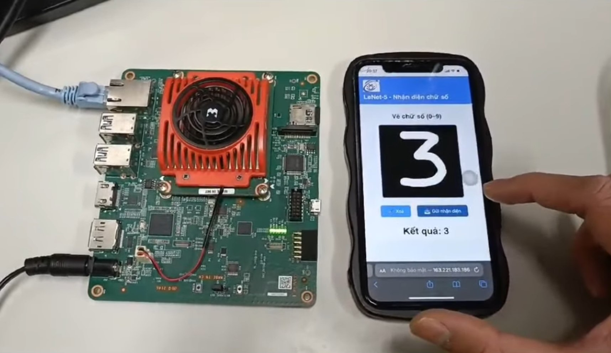
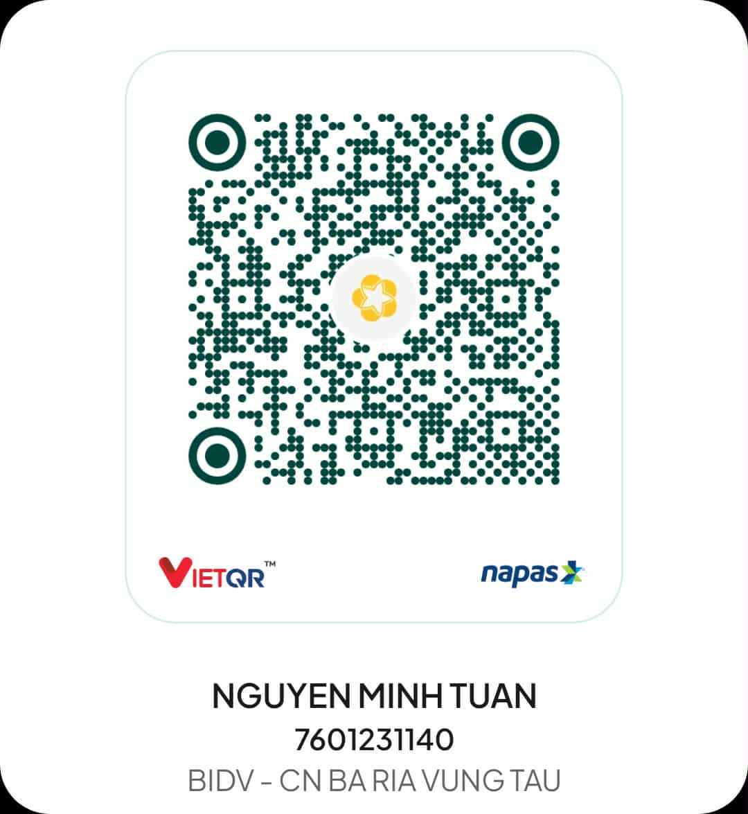

# Real-time Handwritten Digit Recognition on FPGA

## 1. Introduction
This project implements a handwritten digit recognition system (LeNet-5) on FPGA using Vitis High-Level Synthesis (HLS) and integrates the generated IP into a Zynq UltraScale+ SoC platform. The model is trained in Python (Keras/TensorFlow), converted to C using a Py2C tool, synthesized into RTL using Vitis HLS, and finally deployed as a hardware accelerator on the KV260 FPGA board.

## 2. System Overview
The workflow consists of the following stages:
1. Train the LeNet-5 model using Google Colab.
2. Convert the trained model (.h5) to fixed-point C code using Py2C.
3. Add AXI interfaces in CNN.cpp for SoC communication.
4. Perform C Simulation, C Synthesis, and C/RTL Co-simulation in Vitis HLS.
5. Export RTL as an IP core and integrate into the Vivado Block Design.
6. Map BRAMs for input image and weights.
7. Control the accelerator using a C program running on ARM CPU.

## 3. Hardware Platform
- FPGA Board: KV260
- Toolchain: Vivado 2022.2 and Vitis HLS 2022.2
- AXI Interfaces: AXI Master (data) and AXI-Lite (control)
- Memory Mapping: BRAM for images and weights

## 4. Software Requirements
- Python (Keras/TensorFlow)
- Google Colab
- Py2C conversion tool
- Vitis HLS 2022.2
- Vivado 2022.2
- C runtime for control code

## 5. Build Steps
1. Train the model in Colab and export to .h5
2. Convert Python model to C using Py2C
3. Add pragmas for AXI in CNN.cpp
4. Create a Vitis HLS project and run simulations
5. Generate RTL and export IP
6. Import IP into Vivado and build the SoC design
7. Write and run C code on ARM processor to control the accelerator

## 6. Fixed-point Representation
The accelerator uses Q16.16 fixed-point format. An integer value of N is represented as N shifted left by 16 bits.

## 7. Result
The accelerator runs LeNet-5 on FPGA and produces classification results by reading the OutModel register through AXI-Lite. The output is verified through co-simulation and integrated C control software.

## 8. Future Improvements
- Add camera input for full real-time pipeline
- Optimize resource usage and frequency
- Quantization-aware training for higher accuracy

## 9. Donation
If you find this project useful and would like to support further development or to help students continue working on this topic as their thesis or research project, you can donate via the bank account below.

## 10. License
MIT License

